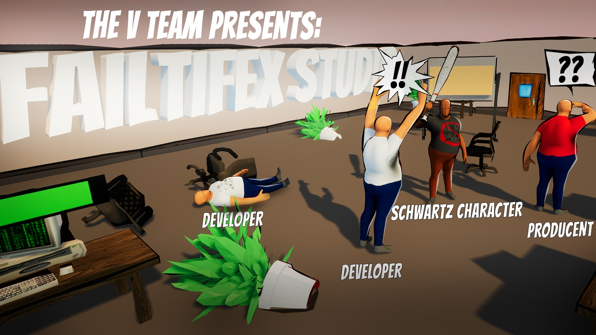

# Failtifex Studio

This is a project made in Unreal Engine 4 for [AmJam 2017](https://amjam.artifexmundi.com/poprzednie/amjam-2017/).

It's compatible with Unreal Engine 4.16

The game requires two game pads to play, so you will need a friend :)

----

**1.Intro**  
  
Meet a team at the edge of an epic fail.  

Job of Player 1, the Developer, is to pick tickets from the board and complete tasks at any workstation. Tasks vary in difficulty: blue are the easiest, but red bring sprint closer to completion. That the clock is ticking!  

Player 2 plays as Schwarz Charakter. Management has messed with him one time too many. He will sabotage the sprint on his last day of work and spread the majestic mayhem without alerting the producer in the other room.  

Will team of Failtifex Studio fail fast or complete sprint successfully?  

**2. Controls**  
*Developer:*  
Movement - left analog stick  
Context Action - (A)  

*Schwarz Charakter:*  
Movement 			- left analog stick  
Attack				- (A)  

**3. Gameplay**  
*Developer:*  
Stand next to a board and pick task with "A", then go to a workstation and keep on pressing "A" fast to fill in the task progress bar. Complete the sprint before time runs out.  
	
*Schwarz Charakter:*  
Press "A" to use your bat. Hit workstations to break them, but not too fast, or producer will check on you. Don't let him catch you red-handed or he will give you a talk. You only win if by time's end the sprint fails.  

**Credits:**

--- The V-Team ---  
*Programming:*  
Piotr Hawryluk  
Damian Nowakowski  
*Art:*  
Adam Frañczak  
*Design:*  
Konrad Knapek  

----

More about the project: http://zompi.pl/failtifex-studio-the-amjam-2017-game/

Don't want to build? It's ok, You can download and play it from here (Windows 64bit only) https://zompi.itch.io/failtifex-studio

Don't want to play? Uh.. okeyyyy... There is a gameplay video on youtube as well :D https://www.youtube.com/watch?v=QOItXHHJPA0
